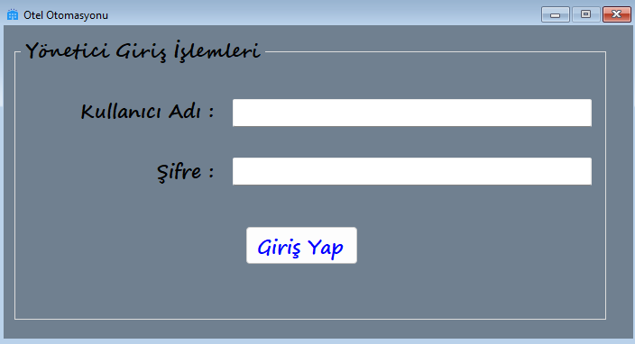
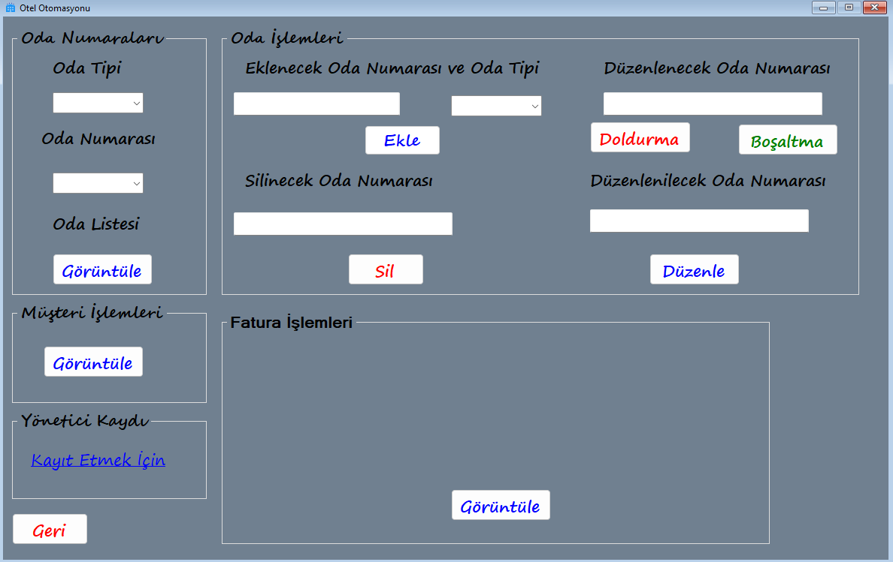
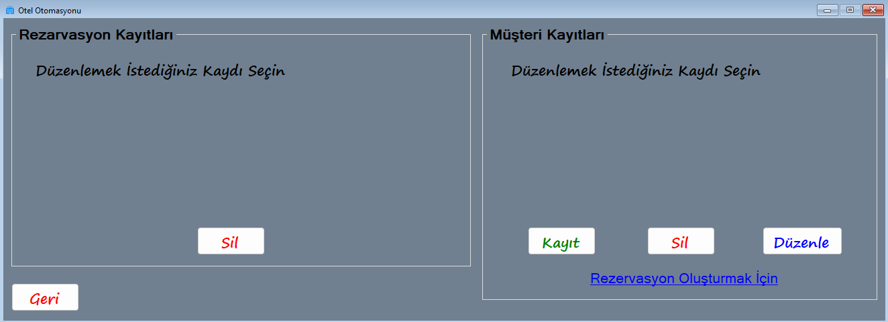
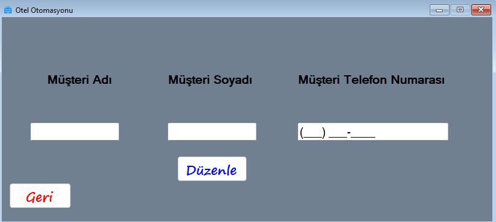
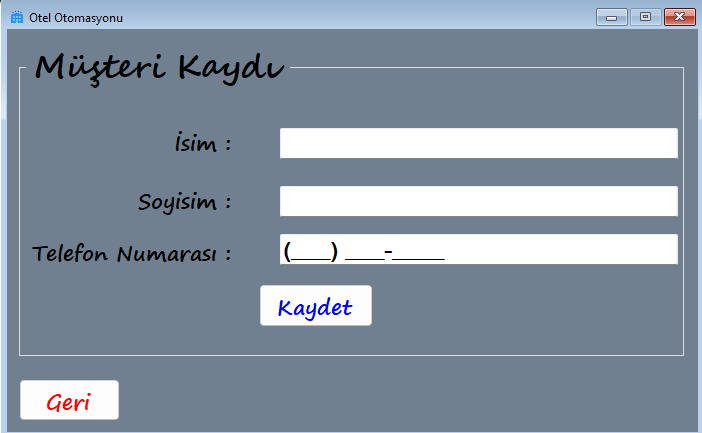
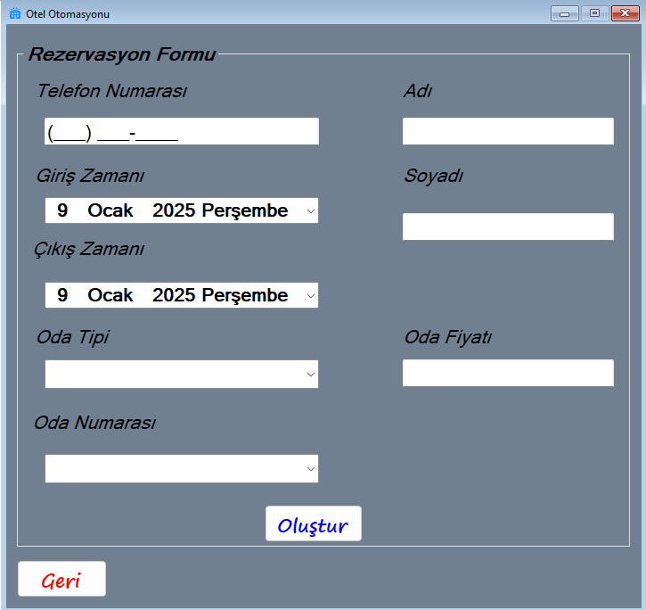
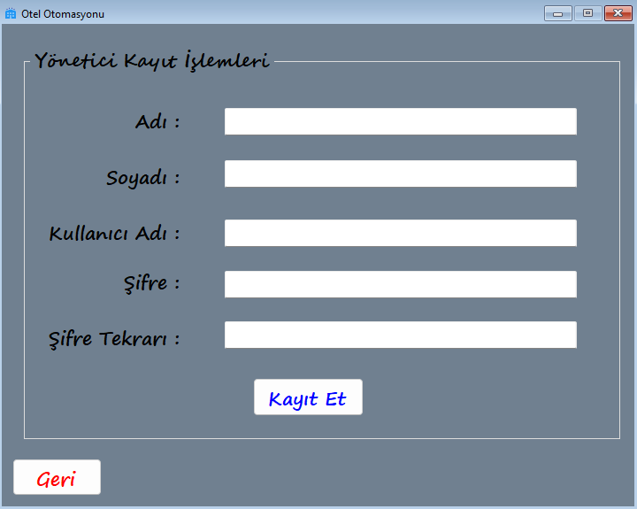
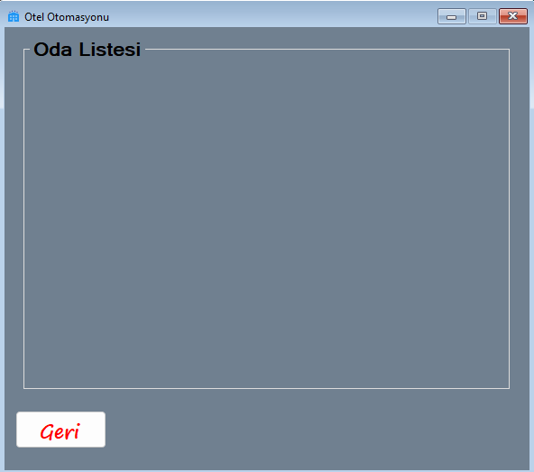
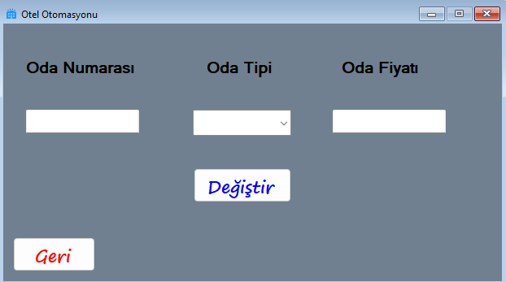
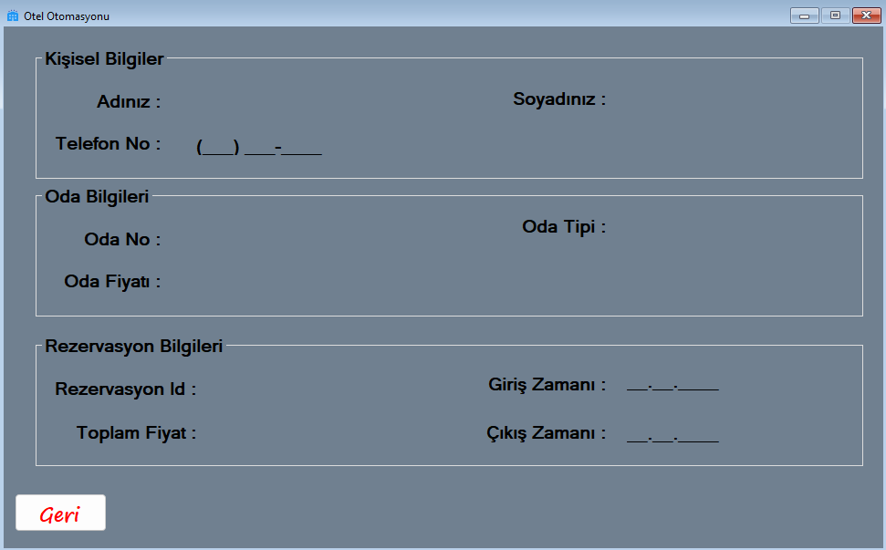

### OtelOtomasyon Yönetim Sistemi

Otel Otomasyon Sistemi'nde yönetici sisteme giriş yaparak oteldeki oda ekleyebilecek , silebilecek , uygun veya uygun değil şeklinde durumunu düzenleyebilecek ve de oda tipini düzenleyebilecek .

Yönetici müşteri ekleyebilecek , silebilecek ve bilgilerini güncelleyebilecek ayrıca müşteri adına rezervasyon yapabilecek , silebilecek ve rezervasyonun faturasını görüntüleyebilecek .

Yönetici sisteme giriş yaptıktan sonra yine kendisi gibi bir yönetici ekleyebilecek .

 

Yönetici bu formda sisteme giriş yapmak için kayıtlı olan kullanıcı adı ve de şifresini girecek .

Yönetici bu formda oda ekleyebilecek , silebilecek , durumunu güncelleyebilecek ve de oda tipini değiştirebilecek . Bu formdan müşteri işlemleri , oda listesi , yönetici kaydı ve fatura formlarına geçiş yapabilecektir .

Yönetici bu formda müşteri ve rezervasyon listesine bakabilecek , müşteri kaydedebilecek , silebilecek , bilgilerini düzenleyebilecek ve müşteri adına rezervasyon yapabilecek .

Yönetici bu formda müşterinin bilgilerini değiştirebilecek .

Yönetici bu formda müşteri kaydedebilecektir .

Yönetici bu formdan önce FormCustomer.cs üzerinde listeden bir müşteri seçecek ve bu forma geçtiğinde seçtiği müşterinin telefon numarası , adı ve soyadı gözükecektir . Bu form üzerinde yönetici müşterinin otele giriş tarihi , otelden çıkış tarihi , hangi tip odada kalacağı ve oda numarasının kaç olacağını seçecektir . Yönetici bu formda oluştur butonuna basınca hem rezervasyon oluşturacak hem de rezervasyonun faturasını oluşturacaktır .

Yönetici bu formda kendi gibi bir yöneticinin kaydını yapacaktır .

Yönetici bu formda oda listesini görüntüleyebilecektir .

Yönetici bu formdan önce FormAdmin.cs üzerinde bir oda seçicek ve bu forma geçince seçili odanın bilgisini değiştirebilecektir .

Yönetici bu formdan önce FormAdmin.cs üzerinde fatura tablosunda bir fatura seçicek ve bu forma geçince seçtiği faturanın bilgileriyle birlikte müşterinin adını , soyadını ve telefon numarasını ayrıca odanın numarasını , tipini ve odanın günlük fiyatını ve son olarak rezervasyonun Id'sini , müşterinin otele giriş zamanını , otelden çıkış zamanını ve toplam fiyatı görüntüleyebilecektir .
