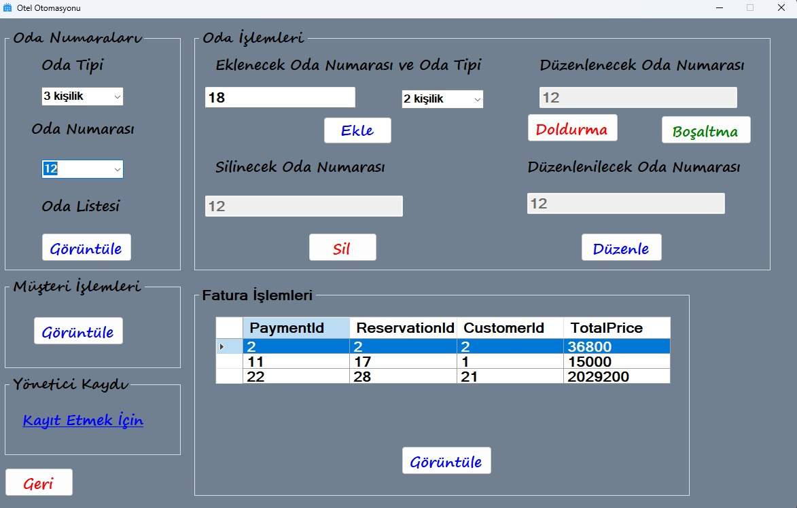

# OtelOtomasyon Yönetim Sistemi

+ Otel Otomasyon Sistemi'nde yönetici sisteme giriş yaparak otelde oda ekleyebilecek , silebilecek , uygun veya uygun değil şeklinde durumunu düzenleyebilecek ve de oda tipini düzenleyebilecek .

+ Yönetici müşteri ekleyebilecek , silebilecek ve bilgilerini güncelleyebilecek ayrıca müşteri adına rezervasyon yapabilecek , silebilecek ve rezervasyonun faturasını görüntüleyebilecek .

+ Yönetici sisteme giriş yaptıktan sonra yine kendisi gibi bir yönetici ekleyebilecek .

#
#
## Diyagramlar
### Use Case Diyagramı

+ Yönetici otele bağlıdır ve sisteme giriş yaparak oda , müşteri , rezervasyon ve fatura yönetimini yapar .

#
#
### Sınıf Diyagramı

+ Yönetici müşteri , fatura , rezervasyon ve oda ilişkisi birden çoğa olacak şekildedir . Oda rezervasyon ilişkisi de birden çoğa olacak şekildedir ayrıca rezervasyon fatura ilişkisi birden biredir.

#
#
### ER Diyagramı

+ Yönetici 'de adminId primary key'dir . Müşteri'de customerId primary key'dir . Oda'da roomId primary key'dir . Rezervasyon'da reservationId primary key , roomId ve customerId foreign key'dir . Fatura'da paymnetId primary key , reservationId ve customerId foreign key'dir .

#
#
## Proje Görüntüleri
### Admin Giriş Formu
 

+ Yönetici bu formda sisteme giriş yapmak için kayıtlı olan kullanıcı adı ve de şifresini girecek .

#
#
 ### Admin Ana Formu

+ Yönetici bu formda oda ekleyebilecek , silebilecek , durumunu güncelleyebilecek ve de oda tipini değiştirebilecek . Bu formdan müşteri işlemleri , oda listesi , yönetici kaydı ve fatura formlarına geçiş yapabilecektir .
#
#
### Müşteri Formu

+ Yönetici bu formda müşteri ve rezervasyon listesine bakabilecek , müşteri kaydedebilecek , silebilecek , bilgilerini düzenleyebilecek ve müşteri adına rezervasyon yapabilecek .
#
#
### Müşteri Düzenleme Formu

+ Yönetici bu formda müşterinin bilgilerini değiştirebilecek .
#
#
### Müşteri Kayıt Formu

+ Yönetici bu formda müşteri kaydedebilecektir .
#
#
### Rezervasyon Formu

+ Yönetici bu formdan önce FormCustomer.cs üzerinde listeden bir müşteri seçecek ve bu forma geçtiğinde seçtiği müşterinin telefon numarası , adı ve soyadı gözükecektir . Bu form üzerinde yönetici müşterinin otele giriş tarihi , otelden çıkış tarihi , hangi tip odada kalacağı ve oda numarasının kaç olacağını seçecektir . Yönetici bu formda oluştur butonuna basınca hem rezervasyon oluşturacak hem de rezervasyonun faturasını oluşturacaktır .
#
#
### Yönetici Kayıt Formu

+ Yönetici bu formda kendi gibi bir yöneticinin kaydını yapacaktır .
#
#
### Oda Listesi Formu

+ Yönetici bu formda oda listesini görüntüleyebilecektir .
#
#
### Oda Düzenleme Formu

+ Yönetici bu formdan önce FormAdmin.cs üzerinde bir oda seçicek ve bu forma geçince seçili odanın bilgisini değiştirebilecektir .
#
#
### Youtube Linki

+ Youtube videosu linki = https://youtu.be/iTt9VyocPB0
